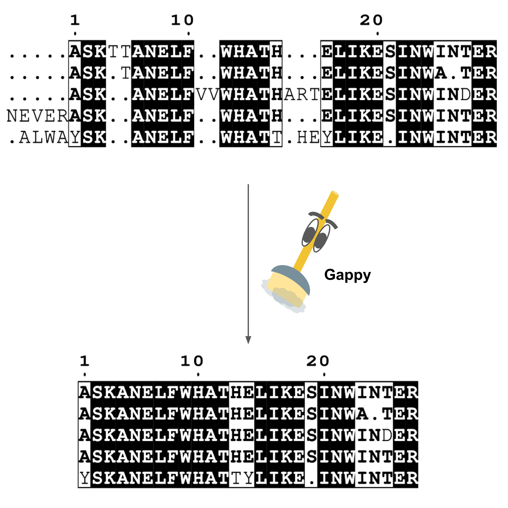

# GapClean (v1.0) 
###### Written by Aarya Venkat, PhD

#### Description:  
GapClean takes a gappy multiple sequence alignment and removes columns with gaps at a  
specified threshold value to produce a "cleaner" and easier to visualize sequence alignment.

Can also be used to remove gaps in an alignment relative to a seed sequence to assess site-wise mutational
information.  

#### Usage: gapclean [options]

   `-i`   Input file       (Required)

   `-o`   Output file      (Required)

   `-t`   Threshold value  (Optional) Cannot be used with seed argument

   `-s`   Seed index       (Optional) Cannot be used with threshold argument

   `-h`   Display this help message

#####  Example: `gapclean -i input.fa -o output.fa -t 95`

#####  Example: `gapclean -i input.fa -o output.fa -s 0` # Takes first sequence as the seed and removes gaps relative to seed.

  
  
## INSTALLATION:

1. Download gapclean and the bucket folder and copy both to your local bin (EG: `/usr/local/bin/`)

2. `chmod +x gapclean`

3. Thank Gappy for his service. He is a retired detective.
