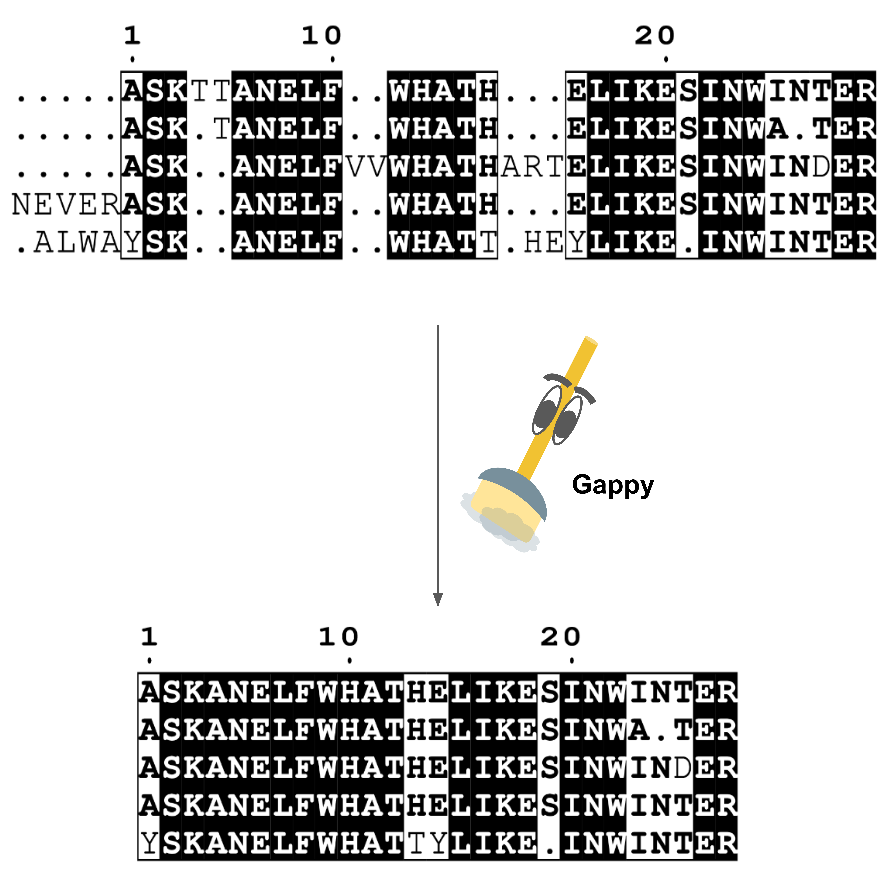

# GapClean (v1.0.5) 
###### Written by Aarya Venkat, PhD



[](https://github.com/arikat/GapClean/actions)
[](https://pypi.org/project/gapclean/)
[](https://www.python.org/downloads/)
[](https://opensource.org/licenses/MIT)

## Description

GapClean is a memory-efficient tool for cleaning gappy multiple sequence alignments in FASTA format. It offers three powerful modes for gap removal:

- **Threshold Mode**: Remove columns exceeding a gap percentage
- **Seed Mode**: Remove gaps relative to a reference sequence
- **Entropy Mode**: Remove low-diversity columns using Shannon entropy

**NEW in v1.0.5:**
- **Multi-format support**: Stockholm, Clustal, PHYLIP, FASTA
- Auto-detect input format (no flags needed!)
- Convert between formats seamlessly
- **Works with Pfam alignments** (.sto files)

**Also in v1.0.4:**
- Simple Python API for notebooks and scripts
- Auto-managed temp files (no manual cleanup!)
- Returns statistics dict with metrics and timing

**And v1.0.3:**
- Entropy-based gap removal mode
- Pure Python implementation (Windows compatible!)
- Comprehensive testing and documentation

## Features

- **Memory Efficient**: Process alignments larger than RAM using 2D chunking
- **Fast**: Optimized NumPy operations for gap detection
- **Scalable**: Handles million-sequence datasets (1M+ sequences in 35 seconds)
- **Cross-Platform**: Works on Windows, macOS, and Linux
- **Flexible**: Three gap removal modes for different use cases
- **Well-Tested**: 48+ tests ensuring reliability

## Performance

Benchmarks on Apple M1 (16 GB RAM) using Pfam protein families (70% gap threshold):

| Scale | Dataset | Sequences | Positions | Time | Size |
|-------|---------|-----------|-----------|------|------|
| Tiny | PF08087 (Conotoxin) | 42 | 36 | <0.1s | 2 KB |
| Medium | PF00535 (GT2) | 157,052 | 1,285 | 11s | 206 MB |
| **Large** | **PF00069 (Kinase)** | **1,051,876** | **3,667** | **35s** | **7 GB** |

Processing time scales linearly with alignment size (R² = 0.998). From tiny families (42 sequences) to million-sequence datasets with negligible overhead.

## Installation

```bash
pip install gapclean
```

**Requirements**: Python 3.8+

## Quick Start

### Threshold Mode
Remove columns with >75% gaps:
```bash
gapclean -i input.fa -o output.fa -t 75
```

### Seed Mode
Remove gaps relative to first sequence:
```bash
gapclean -i input.fa -o output.fa -s 0
```

### Entropy Mode (NEW!)
Remove columns based on diversity:
```bash
# Keep variable regions (SNP detection)
gapclean -i input.fa -o output.fa --entropy-min 1.0

# Keep conserved regions (alignment cleaning)
gapclean -i input.fa -o output.fa --entropy-max 1.5
```

## Usage

```
gapclean [options]

Required Arguments:
  -i, --input    Input aligned FASTA file
  -o, --output   Output cleaned FASTA file

Gap Removal Mode (choose one):
  -t, --threshold      Percentage threshold (0-100)
  -s, --seed           Seed sequence index (0-based)
  --entropy-min        Remove columns with entropy < threshold (keep variable)
  --entropy-max        Remove columns with entropy > threshold (keep conserved)

Optional Arguments:
  --row-chunk-size   Sequences per chunk (default: 5000)
  --col-chunk-size   Columns per chunk (default: 5000)
  -h, --help         Show help message
```

## Examples

### Phylogenetic Analysis
```bash
# Remove very gappy columns before tree building
gapclean -i gene_alignment.fa -o cleaned.fa -t 80
```

### Variant Analysis
```bash
# Remove gaps relative to reference genome (first sequence)
gapclean -i variants.fa -o positions.fa -s 0
```

### SNP Detection
```bash
# Keep only variable positions (DNA)
gapclean -i population.fa -o snps.fa --entropy-min 1.0
```

### Stockholm Format (Pfam)
```bash
# Auto-detects Stockholm input, outputs FASTA (fast - recommended!)
gapclean -i PF00535.sto -o cleaned.fa -t 70

# Stockholm output (slower - only if you need the metadata)
gapclean -i pfam_seed.sto -o cleaned.sto --output-format stockholm -t 75

# Explicit format specification
gapclean -i pfam_seed.sto -o cleaned.txt -t 75 --output-format fasta
```

### Format Conversion
```bash
# Convert Clustal to FASTA while cleaning (recommended - fast)
gapclean -i alignment.aln -o output.fa -t 50

# Convert FASTA to Stockholm (slower for large alignments)
gapclean -i input.fa -o output.sto --output-format stockholm -t 75
```

**Performance Note:** Stockholm/Clustal/PHYLIP output is much slower than FASTA for large alignments (100K+ sequences) due to BioPython's format writers. GapClean defaults to FASTA output for optimal performance. Use `--output-format` only if you specifically need non-FASTA formats.

### Memory-Constrained Systems
```bash
# Process large alignment with limited RAM
gapclean -i huge_alignment.fa -o cleaned.fa -t 75 \
  --row-chunk-size 1000 --col-chunk-size 1000
```

## Python API

Use GapClean programmatically in Python scripts and Jupyter notebooks:

```python
from gapclean import clean_alignment

# Threshold mode - remove columns with >50% gaps
stats = clean_alignment(
    input_file='input.fa',
    output_file='output.fa',
    threshold=50
)

print(f"Removed {stats['columns_removed']} columns")
print(f"Took {stats['elapsed_seconds']:.1f} seconds")

# Stockholm format (auto-detected)
stats = clean_alignment('pfam.sto', 'cleaned.fa', threshold=70)

# Explicit format conversion
stats = clean_alignment(
    'input.aln', 'output.sto',
    threshold=50,
    input_format='clustal',
    output_format='stockholm'
)

# Seed mode - remove gaps relative to first sequence
stats = clean_alignment('input.fa', 'output.fa', seed_index=0)

# Entropy mode - keep only conserved regions
stats = clean_alignment('input.fa', 'output.fa', entropy_max=1.5)

# Quiet mode for pipelines
stats = clean_alignment('input.fa', 'output.fa', threshold=75, verbose=False)
```

### Why use the Python API?

- **One function call**: No temp file management, no subprocess overhead
- **Multi-format support**: Stockholm, Clustal, PHYLIP, FASTA - auto-detected!
- **Returns statistics**: Get metrics about the cleaning operation
- **Perfect for pipelines**: Integrate into larger bioinformatics workflows
- **Jupyter-friendly**: See the included visualization tutorial notebook

## Documentation

**Full documentation available at: [https://arikat.github.io/GapClean/](https://arikat.github.io/GapClean/)**

- [Installation Guide](https://arikat.github.io/GapClean/installation/)
- [Quick Start Tutorial](https://arikat.github.io/GapClean/quickstart/)
- [Usage Guides](https://arikat.github.io/GapClean/usage/threshold-mode/)
- [Advanced Topics](https://arikat.github.io/GapClean/advanced/chunking/)
- [API Reference](https://arikat.github.io/GapClean/api/reference/)

## What's New in v1.0.3

- **Entropy-based gap removal**: Identify variable and conserved regions
- **Windows compatibility**: Pure Python, no external dependencies
- **Better error messages**: Clear, actionable feedback
- **Type hints**: Full type annotations for better IDE support
- **Comprehensive tests**: 48+ tests for reliability
- **Professional docs**: Beautiful Material for MkDocs site
- **CI/CD**: Automated testing on Windows, macOS, Linux

See [CHANGELOG](https://arikat.github.io/GapClean/changelog/) for full details.

## Citation

If you use GapClean in your research, please cite:

```
Venkat, A. (2026). GapClean: Memory-efficient gap removal for multiple sequence alignments.
https://github.com/arikat/GapClean
```

## Contributing

Contributions are welcome! See [CONTRIBUTING.md](https://arikat.github.io/GapClean/contributing/) for guidelines.

## License

MIT License - see [LICENSE](LICENSE) file for details.

## Support

- **Documentation**: https://arikat.github.io/GapClean/
- **Issues**: https://github.com/arikat/GapClean/issues
- **PyPI**: https://pypi.org/project/gapclean/

---

Thank Gappy for his service. He is a retired detective.
